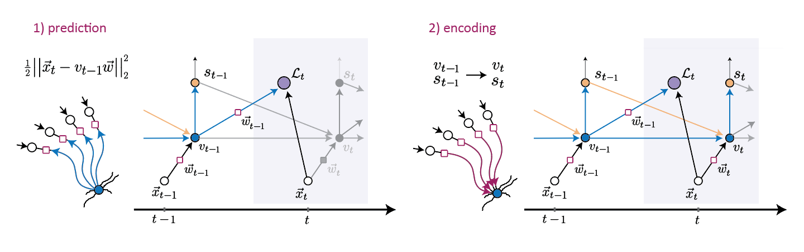

## predictive learning in single neurons

**summary**

this is a repository for the paper:
 "*Sequence anticipation and spike-timing-dependent plasticity emerge from a predictive learning rule*" 
M Saponati, M Vinck 
(2023, Nature Communications) (accepted) 
https://www.biorxiv.org/content/10.1101/2021.10.31.466667v2x

-------------------------

-------------------------

**installation/dependencies**

The current version of the scripts has been tested with Python 3.8. All the dependencies are listed in the environment.yml file. 
The project has a pip-installable package. How to set it up:

- `git clone` the repository 
- `pip install -e . `

**structure**

this repo is structured as follows:

+ `./figures/`: contains the code necessary to reproduce all the figures in the paper
+ `./models/` contains the Python Class of the different models
+ `./scripts/` contains scripts to run the model on different types of inputs and network implementations
+ `./utils/` contains the Python modules for training and the helper functions for the analysis

+ `environment.yml` configuration file with all the dependencies listed
+ `setup.py` python script for installation with pip
-------------------------
